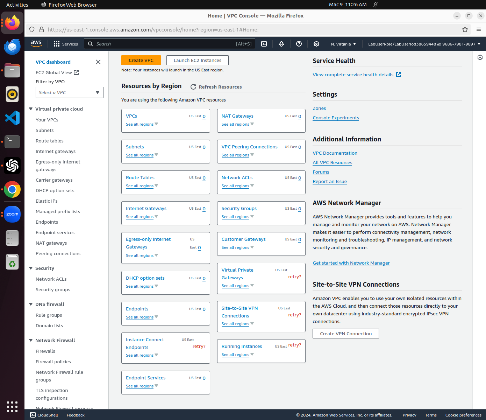
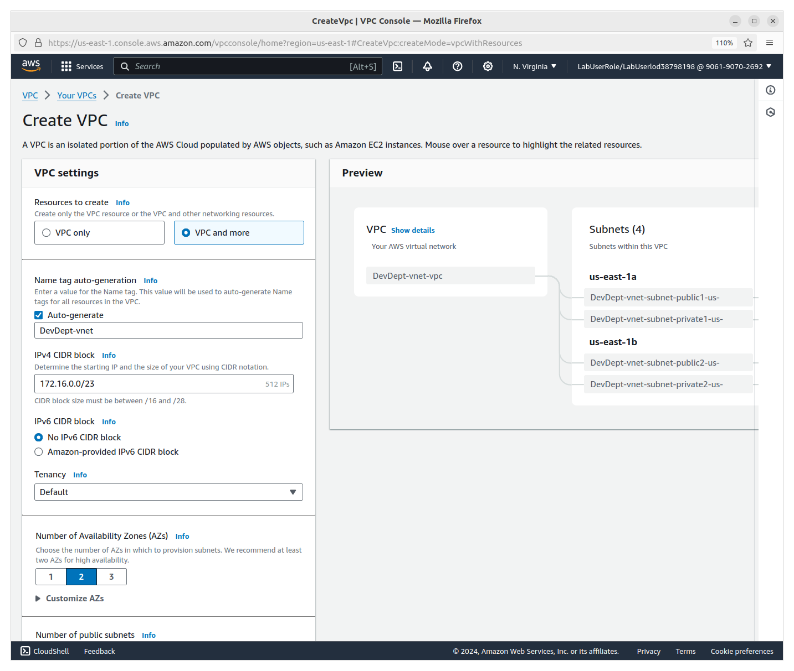
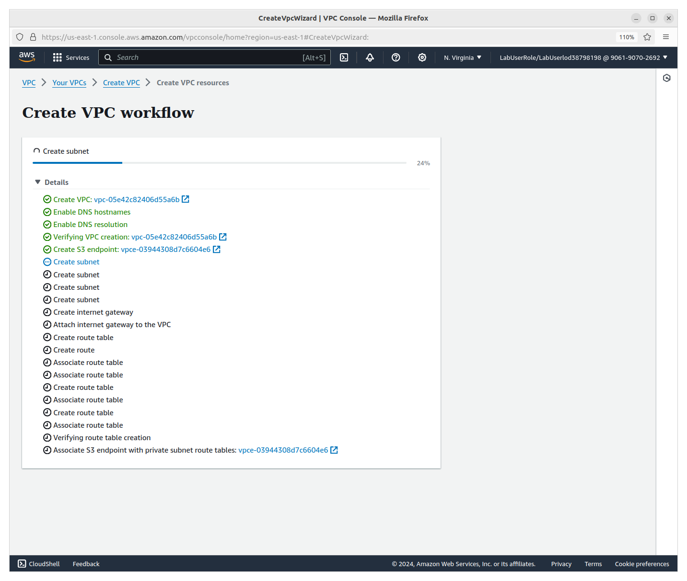
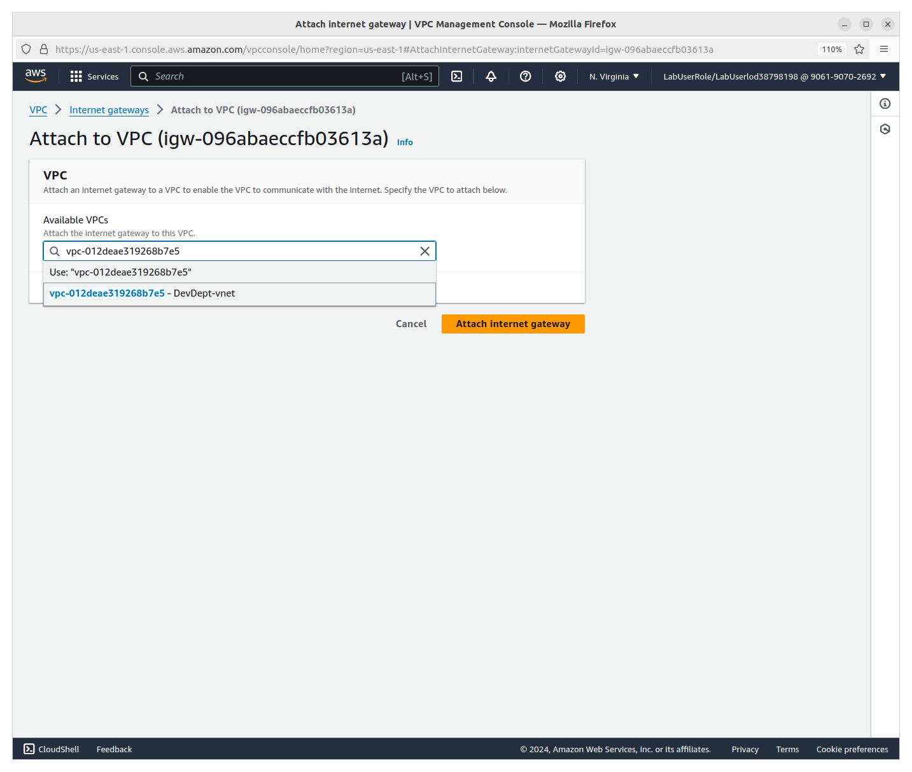
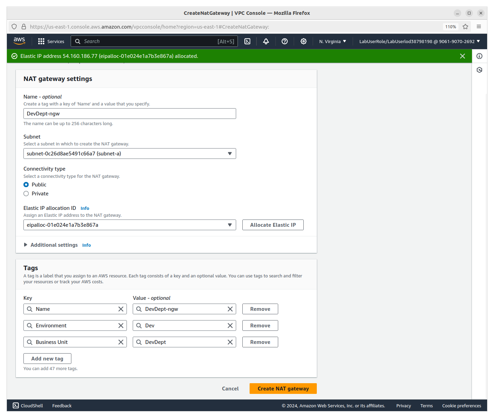
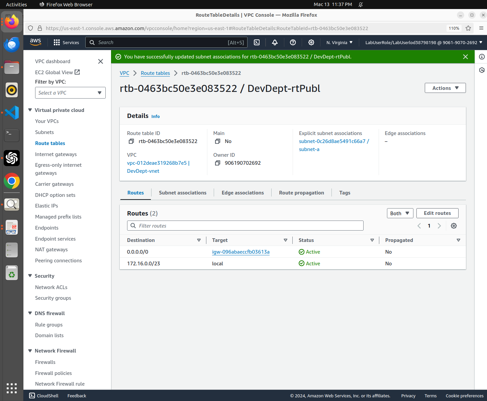
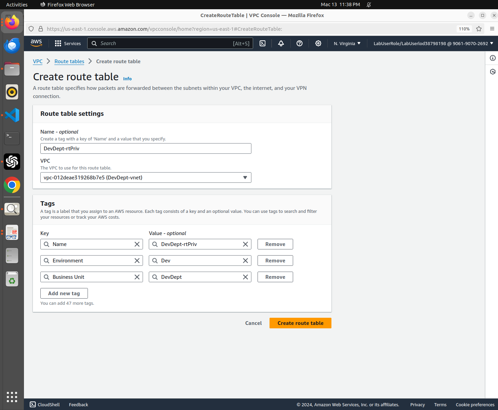
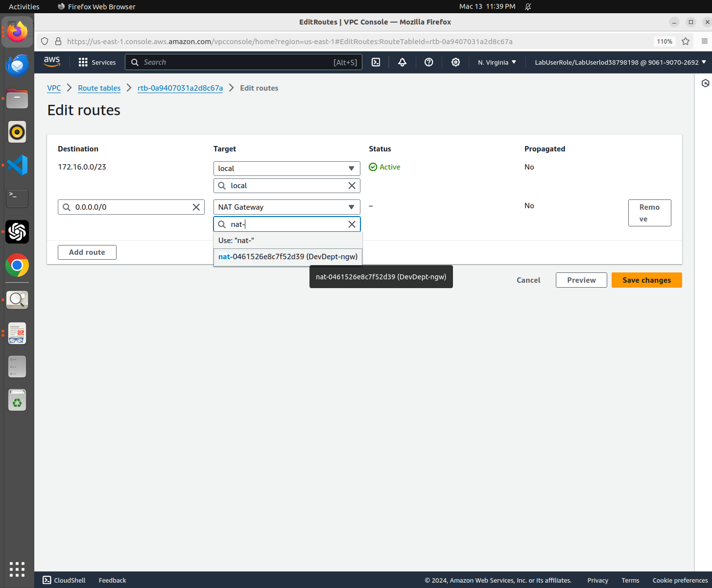
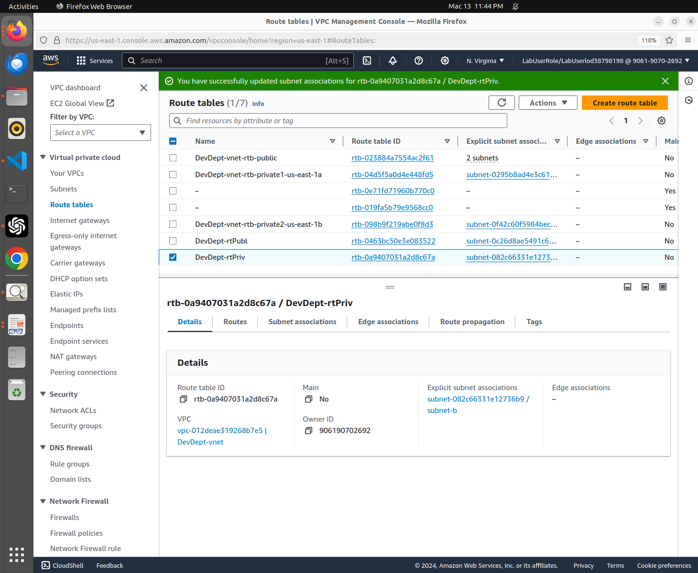

# awsvpc 🌦️
VPC, Subnet, Gateway, Route Table, Cloud Security (Network Isolation)

## Objective
To create a VPC – specify an IPv4 CIDR block (e.g., 10.0.0.0/16).
Create Subnets – Define subnets within the VPC, assigning them to different Availability Zones.
Set Up an Internet Gateway – Attach an internet gateway to allow public access.
Configure Route Tables – Associate route table with subnets to define traffic flow.
Optional : Modify Security Groups & Network ACLs – Set rules to control inbound and outbound traffic.
Test Connectivity – eg. Launch an EC2 instance within the VPC and verify network access.

## AWS Virtual Private Cloud

[//]: 

